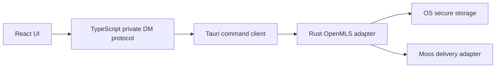

# ADR 0001: OpenMLS private DM adapter

## Status

Accepted

## Context

Mosh private 1:1 chats need message-layer end-to-end encryption. Moss already encrypts transport sessions, but transport encryption is not enough for private chat semantics because messages may traverse relays or future storage surfaces.

## Decision

Use an OpenMLS-oriented native adapter for private DM cryptography. Model a private 1:1 chat as a two-member MLS group. Keep the TypeScript layer responsible for portable protocol orchestration and UI contracts, while Rust/native code owns cryptographic state transitions and secret handling.

## Boundaries

## Consequences

- Private DM ciphertext can travel over Moss without relying on transport confidentiality alone.
- MLS group state must be durable and protected.
- TypeScript tests can validate invite and UI flows without handling raw private keys.
- Real OpenMLS implementation remains a follow-up slice behind the adapter boundary.
