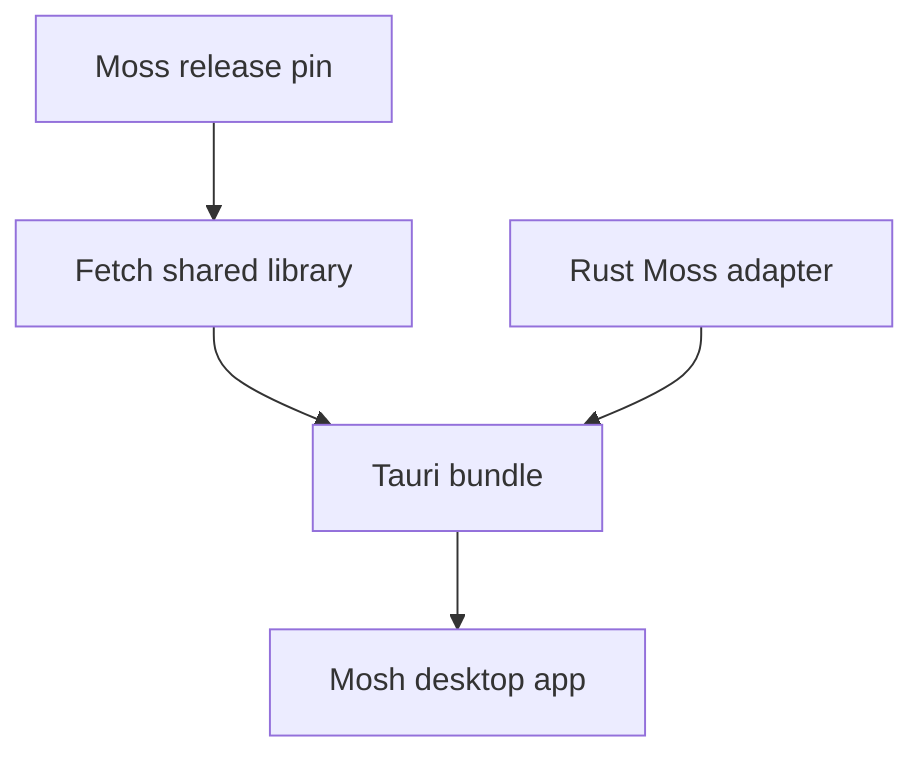

# ADR 0002: Moss dynamic link and release pin

## Status

Accepted

## Context

Mosh consumes the sibling Moss runtime through a native shared library. Development should be fast, while release builds must be reproducible.

## Decision

Dynamically link Moss in v1. CI and release builds use a pinned Moss release version. Development tooling may fetch the latest Moss release only through an explicit update flow that bumps the pin.

## Build Flow

## Consequences

- Local builds avoid copying Moss source into Mosh.
- Release builds are reproducible by default.
- Native library files are ignored and must not be committed.
- The first app scaffold defines the boundary; fetch automation is a later implementation step.
