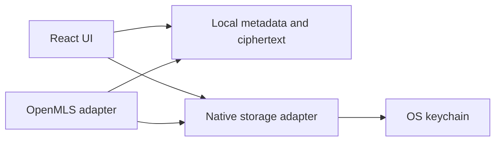

# ADR 0003: Native secure storage for secrets

## Status

Accepted

## Context

Mosh stores device identity, MLS state, and private DM secrets. Browser storage is not an acceptable long-term store for these materials.

## Decision

Store secret material through a native secure-storage adapter backed by the operating system keychain or credential store. Store private history as ciphertext plus minimal indexed metadata.

## Secret Boundaries

## Consequences

- Long-term private keys do not live in localStorage or plain JSON.
- Search over private history is constrained until explicit encrypted-index design exists.
- Tests should exercise storage through public adapter contracts once the concrete backend is added.
