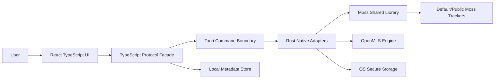
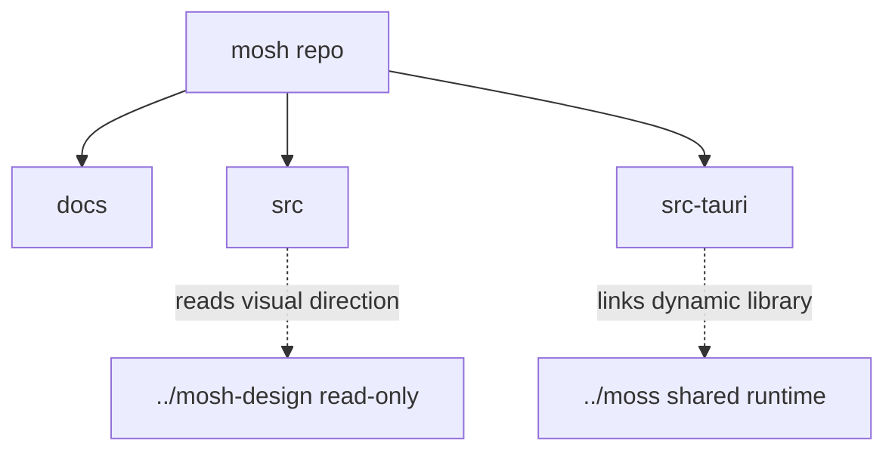
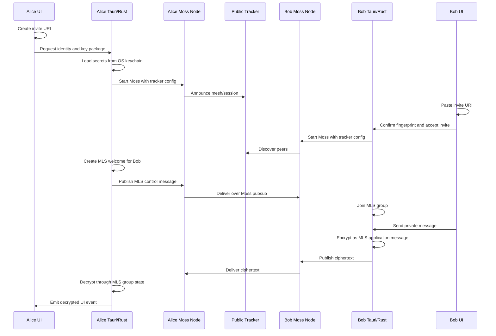
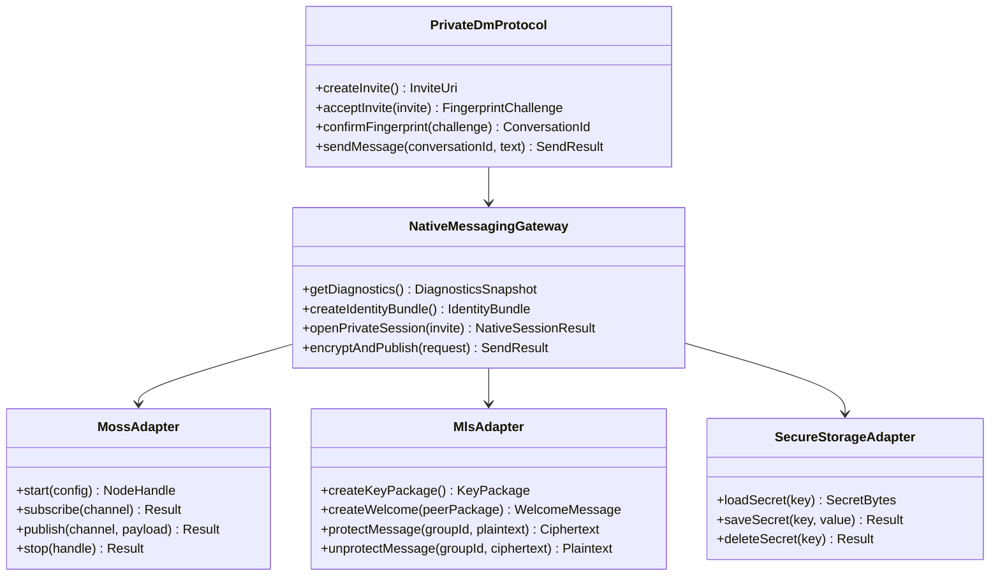

# Mosh Architecture

## Purpose

Mosh is a desktop-first decentralized messenger. The initial architecture targets a Tauri v2 desktop application with a React and TypeScript frontend, a Rust native shell, dynamic Moss shared-library integration, and OpenMLS-oriented private messaging.

## System Boundaries

## Repository Boundaries

Mosh tasks may read `../mosh-design` and `../moss`, but must not modify sibling repositories unless the user explicitly expands scope.

## Private DM Slice

## Interface Contracts

## State Ownership

- Server or network state belongs behind Tauri commands and future query hooks.
- Ephemeral UI state belongs in feature-local React state unless it needs cross-screen access.
- If global UI state becomes necessary, use granular Zustand stores with selectors.
- Do not use `useEffect` plus `useState` for asynchronous data fetching once TanStack Query is configured.
- Private secret material stays in native secure storage, not browser storage.
- Private message history stores ciphertext plus minimal metadata.

## Crypto And Privacy Model

- Moss provides P2P delivery, peer discovery, and encrypted transport sessions.
- OpenMLS provides private DM message-layer E2EE.
- Public/default trackers are used for v1 discovery, so metadata privacy is limited.
- The UI must say private messages are content-encrypted, not anonymous.
- Public chats are planned as signed/authenticated but non-confidential messages.

## Build And Dependency Model

- Moss is dynamically linked in v1.
- Production and CI builds use a pinned Moss release version.
- Development tooling may fetch the latest Moss release and update the pin explicitly.
- Local shared-library binaries are build artifacts and must not be committed.

## First Vertical Slice

The first slice contains:

- onboarding
- invite URI creation and paste
- fingerprint confirmation
- one private DM screen
- diagnostics panel
- adapter contracts for Moss, OpenMLS, and secure storage

Full public rooms, contacts, calls, file transfer, and mobile clients are later slices.
